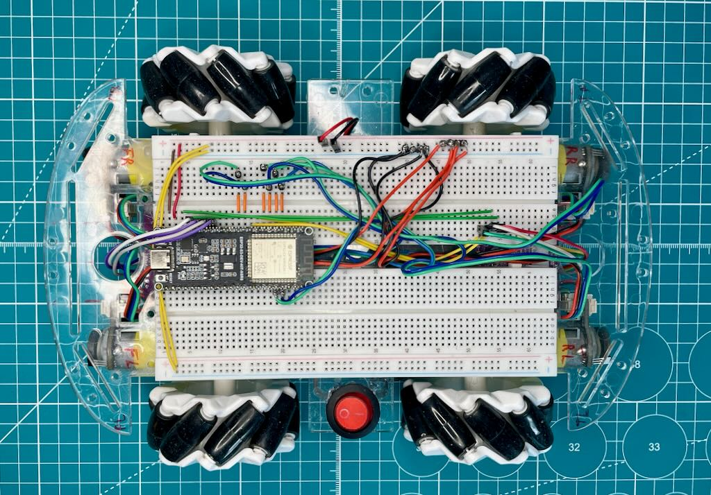
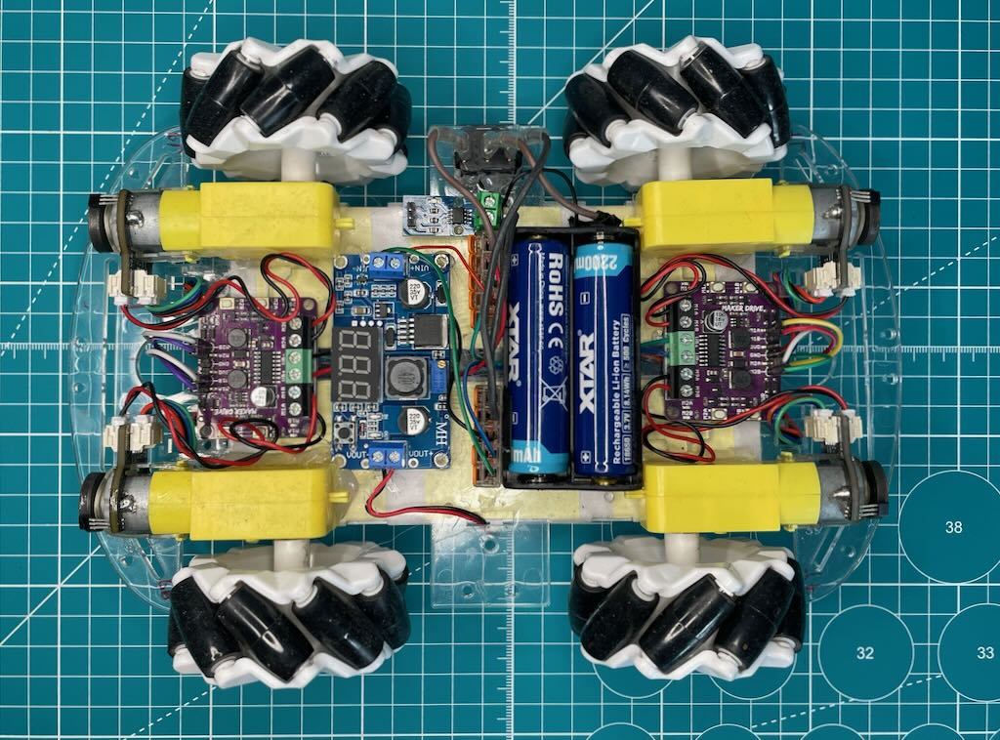

# Mecanum Platform — ESP32-S3 + Encoders + FreeRTOS

Firmware for a four-wheel mecanum robot platform built around an ESP32-S3.
The platform is one half of a two-device system — the other is a handheld pad
that both drives the robot and displays its telemetry. They talk over ESP-NOW.
Wheel speed is measured with incremental encoders and regulated by a per-motor
PID loop driving PWM outputs.

<p align="center">
  
  <br/>
  
</p>

<!-- More photos: add them to assets/ and link them here. -->

---

## Main features

- **ESP32-S3** as the main controller, running at 160 MHz
- **Four DC gearmotors with encoders**, mecanum kinematics (X, Y, rotation)
- **PWM + direction motor drivers**, 20 kHz, 9-bit resolution
- **Closed-loop speed control** — an independent PID per motor
- **FreeRTOS** task architecture: motor control, telemetry and protocol
- **Versioned ESP-NOW protocol** — commands one way, telemetry the other, and a
  refusal to drive if the two devices disagree about the protocol version
- **Failsafe** — the drive is cut when the pad goes silent for longer than
  300 ms. Braking is by coasting; measured on a 20 % slope, where that is enough
  to stop the platform and hold it (see [docs/drivetrain.md](docs/drivetrain.md))
- **Host-side simulators** that run the real `Motor.cpp` and `MecanumDrive.cpp`
  on a desktop machine, so controller behaviour and current draw can be
  inspected without a robot on the floor

Top speed is **measured, not assumed**: 0.28 m/s (90 RPM at the wheel).
Rotation works out to 120 °/s from the geometry, while the stopwatch says
about 138 °/s across repeated runs — a discrepancy that is documented rather
than explained away, in [docs/drivetrain.md](docs/drivetrain.md).

The firmware reads no IMU, no current and no odometry, and the telemetry frame
carries no fields for them. (An ACS712 is left on the chassis from earlier
experiments, with nothing in the firmware reading it.) Every field in
[src/messages.h](src/messages.h) has code that reads it; anything that did not
was removed in protocol v4 rather than left transmitting zeros.

---

## How it works

```
   Pad (Xiao ESP32-S3)                    Platform (this repo)
   ───────────────────                    ────────────────────
   2 joysticks, TFT screen                4 motors + encoders

   MSG_PAD_CONTROL, 50 Hz   ──────────▶   mecanum mixing → 4 × PID → PWM
   MSG_TELEMETRY, 25 Hz     ◀──────────   wheel RPM, PWM, axis echo, link stats
   MSG_HELLO, both ways     ◀────────▶    protocol version, build id
```

Telemetry is a **reply to a pad frame**, not an independent timer. A timer of
its own meant a third unsynchronised loop at a random phase, which made the
round trip jump by a whole period — visible on the pad as a stuttering echo dot.

The pad also acts as the system's diagnostic display, which is why there is no
separate monitor device.

---

## Components

| Part | Model / notes | Qty |
|---|---|---|
| Main microcontroller board | ESP32-S3-DEV-KIT-N8R8, Waveshare 24243 | 1 |
| DC gearmotors with encoders | SJ01 120:1, 6 V, 160 RPM no-load, EAN 6959420910205 | 4 |
| Dual motor driver | Cytron Maker Drive MX1508, 9.5 V / 1 A, EAN 5904422321802 | 2 |
| Mecanum chassis | Smart Robot Car Kit, EAN 500386256 | 1 |
| Breadboard | justPi, 830 points | 2 |
| Battery holder, 2 × 18650 | series, EAN 5904422374341 | 1 |
| 18650 Li-Ion cells | XTAR 18650, 2200 mAh (8.14 Wh) | 2 |
| Step-down converter | LM2596 module with a 3-digit voltmeter — supplies the 5 V rail | 1 |
| Power switch | IRS-101-8C/D illuminated rocker, 12 VDC / 20 A | 1 |
| Lever wire connectors | Wago 221 style — the positive and negative distribution points | 2 |
| Current sensor | ACS712 20 A — fitted and used in experiments, not read by this firmware | 1 |

Drivetrain numbers — wheel diameter, chassis geometry, the RPM-to-speed
conversions — are collected in [docs/drivetrain.md](docs/drivetrain.md).

**Note on the drivers.** The MX1508 is rated 1 A per channel; measured startup
draw is roughly 1.4–1.9 A per motor. They run at or above their rating, which is
a known constraint rather than a surprise.

**Note on the 5 V rail.** The Maker Drive has a 5 V output of its own, rated
200 mA, which is enough to run an ESP32-S3 — but only just, since it leaves no
margin for the current peaks of a radio transmission. The separate LM2596
converter is there deliberately: it keeps the logic supply independent of the
motor boards and leaves headroom for whatever the control side grows into. Its
voltmeter also makes the cell voltage readable without connecting anything.

**Note on the switch.** It breaks a DC circuit, and a rating printed for AC does
not carry over — an arc that alternating current extinguishes at every zero
crossing has nothing to extinguish it in DC. Hence a 20 A DC-rated switch for a
platform that draws under 8 A: the headroom is the point, not the number.

---

## Things worth knowing before changing anything

These are the traps that compile cleanly and pass CI, and then do not work.

- **`src/messages.h` must be byte-identical to the copy in the pad's
  repository.** `static_assert`s on every struct size turn an accidental
  one-sided edit into a compile error; `MSG_HELLO` carries the protocol version;
  and the platform refuses to drive until it has seen a matching version from
  the pad. Refusing to move is the safe failure here — worse than standing still
  is driving on data read through someone else's struct layout.
- **No two wheels may share a kinematics pattern.** If two rows of the mixing
  matrix become identical, the matrix loses rank and the robot becomes
  physically unable to drive sideways. That bug reached this repo once already
  and got through review because the commit message matched the diff exactly.
- **The encoder counts EDGES, not pulses.** 8 pulses per motor shaft revolution
  × 120:1 = 960 pulses per wheel revolution, but `attachHalfQuad` counts both
  edges, so `DEFAULT_GEAR_RATIO` is **1920**. Getting this wrong makes the robot
  travel at exactly half the speed it reports, with no other symptom anywhere in
  the code.
- **The controller gets noisy below about 10 RPM at the wheel.** Speed is
  measured by counting encoder edges over a fixed 20 ms window, so one count is
  1.56 RPM and that is the hard resolution of the measurement. At 2 RPM a wheel
  produces 1.28 counts per cycle: the reading has to alternate between 1.56 and
  3.13, and the controller answers that step as though it were real — about 25
  PWM units of ripple peak to peak. Two things are visible on the driver board,
  and they are not the same thing: the **forward** LED pulses at 50 Hz because
  the duty changes once every 20 ms cycle (the 20 kHz PWM itself is far too fast
  to see), while the **reverse** LED flashes only when the ripple actually
  carries the output through zero — which needs the mean duty to be small, as it
  is at these speeds and as it especially is in the first cycles after the stick
  moves, before the integral has built up. Audible as ticking during very slow
  travel. Above 10 RPM it is gone. The fix is a longer measurement window at low
  speed, not filtering after the fact.
- **PID gains are in millisecond units.** `computePID()` receives `dt` in
  milliseconds, so `Kd = 100` alongside `Kp = 6` is not a typo. Converting:
  `Ki_ms = Ki_s / 1000`, `Kd_ms = Kd_s × 1000`. The gains live in
  [src/motor_config.h](src/motor_config.h) and changing them means a rebuild —
  there is no runtime tuning path. `Motor::setPID()` stays in the class API for
  anyone who wants to add one.
- **Driving forwards does not test the kinematics.** With `vx = 0` every wheel
  gets the same value regardless of the signs on `vx`. Only sideways travel
  verifies the mixing.
- **The cells' current protection is a real design constraint.** It cuts power
  mid-drive if the control demands too much current at once. Any change to the
  PID gains, the limits or the dynamics has to be considered in terms of
  current, not just speed and overshoot — which is what the simulators compute
  it for.

`CLAUDE.md` carries the long-form version of all of this, including why each
decision was made.

---

## Build and flash

Requires [PlatformIO](https://platformio.org/).

```bash
git clone https://github.com/CableAndCode/ESP32S3_Mecanum_Base.git
cd ESP32S3_Mecanum_Base
pio run -t upload
```

**MAC addresses.** The project builds out of the box using the placeholder
addresses in `src/mac_addresses.h`. Edit that file with the MAC addresses of
your own devices, or create `src/mac_addresses_private.h` — if present it takes
precedence, and it is excluded from version control.

Every push and pull request is built by GitHub Actions, so a broken build shows
up before it reaches the hardware.

### Simulators

```bash
./sim/run.sh              # all of them
./sim/run.sh failsafe     # one
```

Only `g++` is needed. They run the real `Motor.cpp` and `MecanumDrive.cpp` with
a substituted clock, encoder and PWM output, and cover the failsafe, the
kinematics normalisation, braking current and position holding. See
[sim/README.md](sim/README.md) — including its warning about how far the motor
model can be trusted.

---

## Roadmap

**Version 1 ends with stage 5.** What is unticked below is not unfinished
business in this firmware — it is the next machine's, and it is listed so the
direction is visible, not as a promise. This version is meant to be a complete
small thing rather than a partial large one.

### Stage 1 — MVP: motors and encoders
- [x] PWM control for all four motors
- [x] Encoder reading per wheel
- [x] FreeRTOS tasks for motor control and telemetry
- [x] Forward, backward and rotation movement
- [x] Serial output of encoder counts and motor status

### Stage 2 — Motion logic
- [x] Velocity (X, Y, angular) derived from encoder data
- [x] Closed-loop PID velocity control
- [x] Fail-safe: cut the drive when the link to the pad goes silent
- [x] Scale and normalise pad input so combined axes cannot exceed `MAX_RPM`
- [x] Verify performance across the speed range and measure the real maximum
- [x] Arc steering: the right stick sets turn tightness rather than raw rotation
- [ ] Odometry tracking for position and heading

### Stage 3 — IMU and sensor fusion
- [ ] Integrate an IMU over I2C
- [ ] Calibrate gyroscope and accelerometer
- [ ] Fuse encoder and IMU data for slip detection and better heading
- [ ] Fallback logic when the IMU or an encoder fails

### Stage 4 — Communication
- [x] Structured message format for commands and telemetry (`src/messages.h`)
- [x] ESP-NOW as the single link between pad and platform
- [x] Protocol versioning with a compile-time size check on every struct
- [x] Frame loss counting from gaps in the sequence numbering
- [ ] Keep `messages.h` in sync across both repositories automatically
- [ ] Slow the platform down when link quality degrades

SPI to the pad was explored and dropped; ESP-NOW is the only channel.

### Stage 5 — Diagnostics on the pad
- [x] Telemetry as a reply to the pad's frame: wheel RPM, PWM, state flags
- [x] Telemetry sent to the pad rather than to a separate monitor module
- [x] System state shown on the pad screen (drive vectors, wheels, link, buttons)
- [ ] Per-wheel current measurement — see [docs/current-sensing.md](docs/current-sensing.md)
- [ ] Report battery voltage and log faults

### Stage 6 — Physical build
- [ ] Move from breadboard to protoboard or PCB
- [ ] Power switch and battery voltage display
- [ ] Mounting for the IMU, with vibration isolation
- [ ] Shielding for analogue current-sensor lines

---

## Notes

This platform is one half of a two-device robotic system:

- The **controller pad** (Xiao ESP32-S3 + TFT display + joysticks), which drives
  the robot and doubles as its telemetry display —
  [Pad_Adafruit_Xiao](https://github.com/CableAndCode/Pad_Adafruit_Xiao)
- The **platform** (this repository)

An earlier design included a separate debug monitor module and a companion
iPhone app. Both were dropped in favour of putting the diagnostics on the pad
itself, which shortens the path to a system that simply works.

Development focus: clean modular code, reproducible experiments, and eventual
integration with ROS2 and machine-learning components.

---

## License

Released under the MIT License. See [LICENSE](LICENSE).

Third-party libraries retain their own licenses:
- [ESP32Encoder](https://github.com/madhephaestus/ESP32Encoder) – BSD 4-clause
- ESP32 Arduino Core (including ESP-NOW and WiFi) – Apache 2.0 / LGPL

This product includes software developed by the "Universidad de Palermo,
Argentina" (http://www.palermo.edu/) — acknowledgment required by the
ESP32Encoder license.
